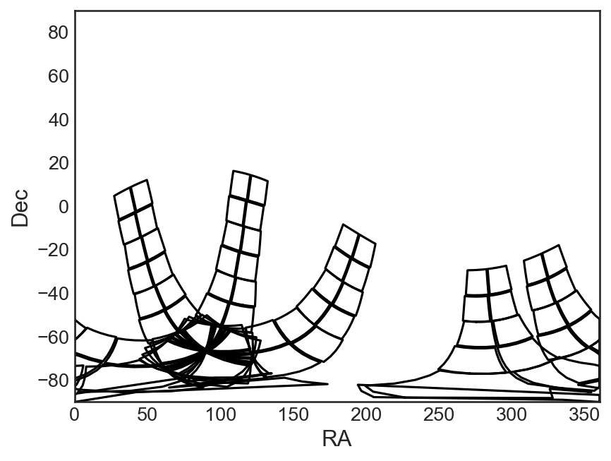
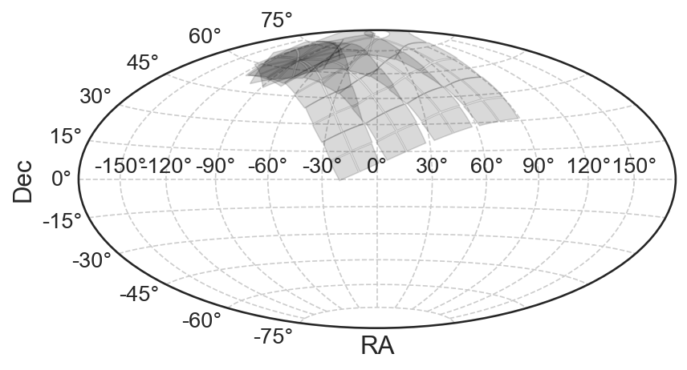
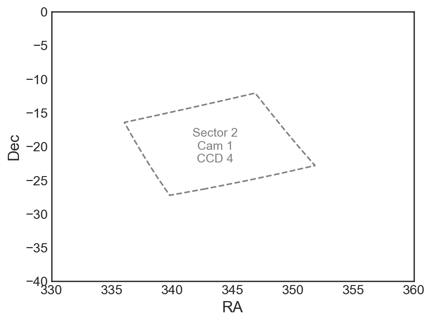

<a href="https://github.com/christinahedges/tessfov/actions/workflows/tests.yml"></a> [](https://christinahedges.github.io/tessfov)

# tessFOV

`tessFOV` will plot the footprint of NASA's TESS Spacecraft pointings on your existing `matplotlib.pyplot.Axes` objects. `tessFOV` uses the [`tess-point`](https://github.com/christopherburke/tess-point) package to find the edges of the CCDs for any given pointing, and provides user friendly functions for plotting these footprints.


## tessFOV Functions

`tessFOV` has the following functions available:

```
add_tessfov_outline: Adds outlines for a given sector, camera, CCD
add_tessfov_shade: Adds shaded regions for a given sector, camera, CCD
add_tessfov_text: Adds labels for a given sector, camera, CCD
```

You can specify any number of sectors `[1 ... 69]`, cameras `[1 .. 4]`, or CCDs `[1 .. 4]`.

## Examples

Below are a few examples of how to use `tessFOV`.

### Adding to `matplotlib` subplot

Below is an example of how to add the footprint to your existing plot. Here we plot a subset of the sectors from Cycle 1, and plot only the outlines of the CCDs. You can pass `matplotlib.pyplot.plot` keyword arguments to `add_tessfov_outline `(e.g. `ls`, `lw`, `color`).

```python
from tessfov import add_tessfov_outline
fig = plt.figure(dpi=150)
ax = plt.subplot(111)
ax.set(xlabel="RA", ylabel="Dec", xlim=(0, 360), ylim=(-90, 90))
add_tessfov_outline(ax, sector=np.arange(1, 14, 3))
```



## Examples

Below are a few examples of how to use `tessFOV`.

### Adding to `matplotlib` map projections

You can add the footprint to [`matplotlib` projections](https://matplotlib.org/3.1.1/gallery/subplots_axes_and_figures/geo_demo.html) (such as the `'hammer'` projection). In these cases you must use the `wrap_at` keyword to ensure that the points "wrap" at 180 degrees. You should also use the unit `'rad'` (radians), as this is what is standard for this plotting projection. Below we plot 4 sectors from Cycle 5.

```python
from tessfov import add_tessfov_shade
fig = plt.figure(dpi=150)
ax = plt.subplot(111, projection="hammer")
add_tessfov_shade(
    ax, sector=np.arange(56, 60), unit="rad", wrap_at=180, rasterized=True
)
ax.set(xlabel="RA", ylabel="Dec")
ax.grid(True, ls="--")
```


## Examples

Below are a few examples of how to use `tessFOV`.

### Adding one CCD

You are able to use `tessFOV` to plot a subset of sectors, cameras and CCDs. Below we plot a single CCD from sector 2, and add a label.

```python
fig = plt.figure(dpi=150)
ax = plt.subplot(111)
ax.set(xlabel="RA", ylabel="Dec", xlim=(330, 360), ylim=(-40, 0))
add_tessfov_outline(ax, sector=2, camera=1, ccd=4, color="grey", ls="--")
add_tessfov_text(ax, sector=2, camera=1, ccd=4, color="grey", fontsize=12)
```


## Gotchas

When adding shaded regions using `add_tessfov_shade`, you may find that the `xlim` and `ylim` of your plot do not update to capture those patches. You should adjust the `xlim` and `ylim` parameters of your `matplotlib.pyplot.Axes` object.

## Installation

You can install `tessFOV` using pip:

```
pip install tessfov --upgrade
```
